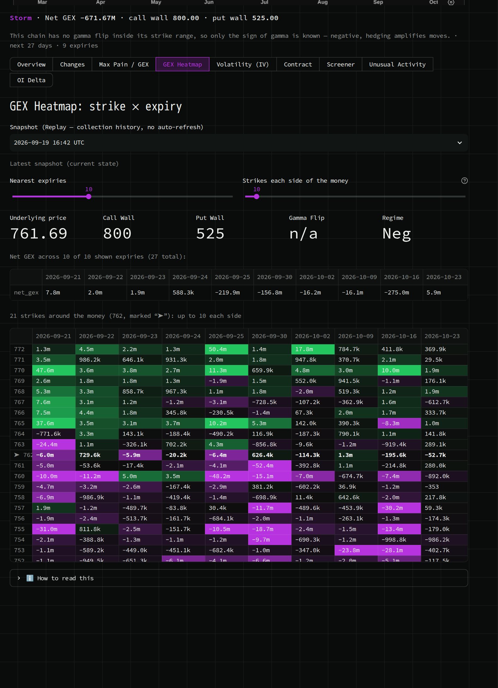
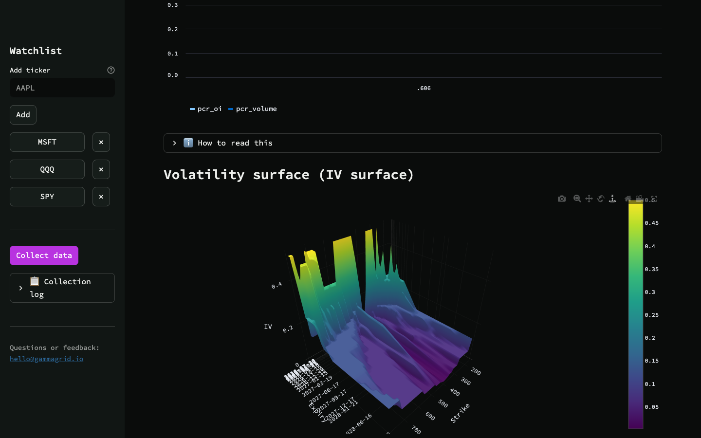
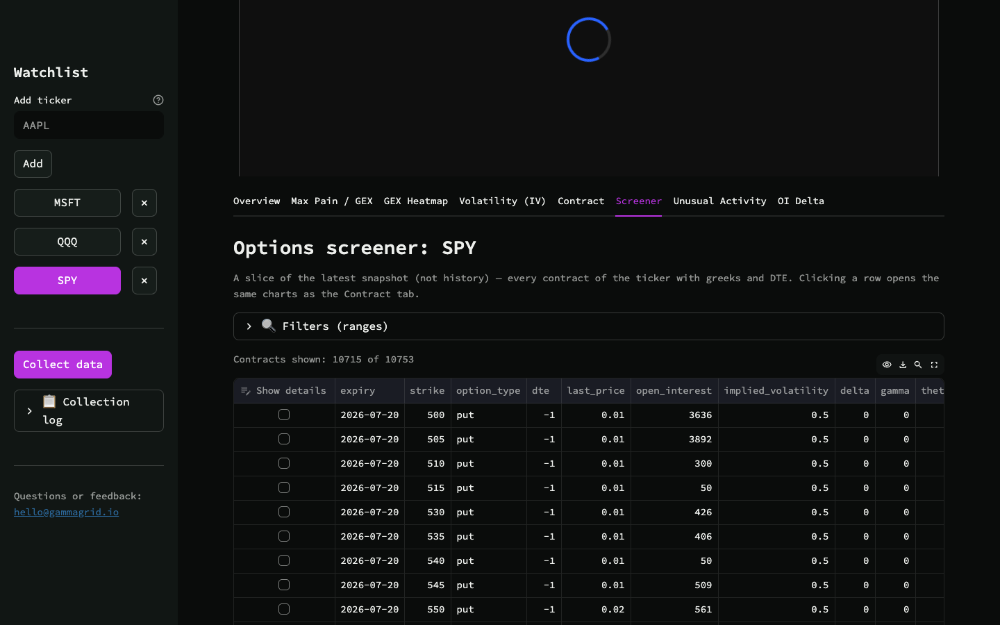

# GammaGrid — Open-Source Options Gamma Exposure (GEX) & Positioning Dashboard

Track **dealer gamma exposure (GEX)**, **max pain**, **open interest**, and the
**IV surface** for your whole options watchlist — not just SPY. Self-hosted,
open source, built on free market data.

[](LICENSE)
[](#quick-start-no-coding-required)
[](https://gammagrid.io/)

Prefer not to run it yourself? A hosted version is in the works —
[leave an email on gammagrid.io](https://gammagrid.io/) and you'll hear when it
opens. Self-hosting stays free and open source either way.

> **No coding required.** If you can install an app and copy-paste one command
> into a terminal, you can run GammaGrid. No Python, no config files, no
> programming experience needed — see [Quick start](#quick-start-no-coding-required) below.



## Quick start (no coding required)

1. **Install Docker Desktop** — [docker.com/products/docker-desktop](https://www.docker.com/products/docker-desktop/).
   It's free; just click through the installer like any other app.
2. **Download this project** — click the green **Code** button at the top of
   this page → **Download ZIP**, then unzip it. (Comfortable with git instead?
   `git clone` this repo.)
3. **Open a terminal in the unzipped folder** — on Mac: right-click the folder
   → *New Terminal at Folder*. On Windows: open the folder in File Explorer,
   type `cmd` in the address bar, press Enter.
4. **Run one command:**
   ```bash
   docker compose up
   ```
   (Older Docker installs: use `docker-compose up` instead — same effect.)
5. **Open [http://localhost:8501](http://localhost:8501) in your browser.**
   That's it — GammaGrid is running.

Your data lives in a Postgres database that `docker compose` starts alongside
the app and keeps in a Docker volume, so it survives restarts. Press `Ctrl+C` to
stop; run the same command again to bring everything back with your data intact.
`docker compose down` also keeps it — only `down -v` deletes it, and that
removes every snapshot you have collected.

Back it up with:

```bash
docker compose exec postgres pg_dump -U gammagrid gammagrid | gzip > gammagrid-backup.sql.gz
```

**Coming from a version before v0.4.0?** Your history is in `data/options.db`
and the app no longer reads that file. `scripts/import_sqlite.py` copies it
across in one command — see [UPGRADING.md](UPGRADING.md), which says per release
what happens to the database you have already filled.

## What you get

- **Dealer gamma exposure (GEX)** — per-expiry profile and a strike × expiry
  heatmap, with Call Wall / Put Wall, Gamma Flip level, and historical Replay
- **Max Pain** for any expiry
- **Open interest**, including day-over-day OI Delta sorted by the size of the move
- **IV surface** (3D volatility surface) plus per-expiry skew and
  volume-weighted average IV over time
- **Options screener** with the full set of greeks (delta, gamma, theta, vega,
  rho, vanna, charm) and range filters — not just delta/IV like most free tools
- **Unusual activity** detection — flags contracts whose volume is a
  statistical outlier against that specific contract's own history, not a
  flat threshold
- **Put/Call Ratio** and per-contract price/IV/greeks history with pinning
- Works for any ticker with a listed options chain — build your own watchlist,
  not a single fixed symbol

## Usage

1. In the left sidebar, enter a ticker (e.g. `AAPL`) and click **Add** — it
   appears in the watchlist.
2. Click **Collect data** — the app fetches the current option chain for every
   watchlist ticker via Yahoo Finance and saves a snapshot. To keep collecting
   without you, pick an interval under **Collect automatically** (see below).
3. Pick a ticker in the dropdown above the tabs to open the metrics:
   - **Overview** — Put/Call Ratio over time and the IV surface
   - **Max Pain / GEX** — max pain and the approximate gamma-exposure profile for a selected expiry
   - **GEX Heatmap** — strike × expiry GEX matrix with Call/Put Walls, Gamma Flip, and snapshot Replay
   - **Volatility (IV)** — ticker-average IV over time and a chain skew slice
   - **Contract** — price, IV, and greeks history for a specific contract, with pinning
   - **Screener** — every contract of the latest snapshot with greeks and range filters
   - **Unusual Activity** — contracts with anomalous volume in the latest snapshot
   - **OI Delta** — open interest change between the two latest calendar days

Most history-based metrics (other than Put/Call Ratio, average IV, and OI
Delta) need several days of collection — some charts require at least two
snapshots, so history is worth building up before the more interesting screens
say anything.

## Automatic collection, and what it costs on disk

**Off by default.** A tool that starts hitting a free API the moment it is
installed has made a decision that was not its to make, so you turn it on:
pick **Off / Every 15 minutes / Hourly / Every 4 hours / Once a day** in the
sidebar. It runs in a small worker container that `docker compose up` already
started, which means it keeps collecting while nobody is looking — and stops
when you stop the containers. Fifteen minutes is the floor: Yahoo throttles
under frequent requests, and the floor is enforced in code, not just in the
list.

Collecting continuously fills a disk, so here is the arithmetic rather than a
shrug. One stored row costs about 214 bytes, and one pass stores one row per
contract in every watchlist ticker's chain — a few hundred for a small single
name, ~14,000 for SPY:

| Interval | Small watchlist (~1,000 contracts) | With an index ETF (~15,000) |
|---|---|---|
| Once a day | ~6 MB/month | ~96 MB/month |
| Every 4 hours | ~39 MB/month | ~578 MB/month |
| Hourly | ~154 MB/month | ~2.3 GB/month |
| Every 15 minutes | ~617 MB/month | ~9.2 GB/month |

The sidebar shows this figure for **your** watchlist at the moment you choose an
interval, computed from what you have already collected rather than from the
table above.

**Nothing is ever deleted.** Contracts that expired more than 30 days ago move
to a separate table so the one every chart reads stays small; their history
stays readable and still appears in every historical view.

## Screenshots

| IV surface | Options screener |
| --- | --- |
|  |  |

All screenshots above are real GammaGrid output — SPY/QQQ/MSFT via a live
collection, no mockups.

## FAQ

**What is dealer gamma exposure (GEX)?** It's an estimate of how much options
market makers are net long or short gamma across a ticker's option chain.
Positive GEX suggests dealer hedging tends to dampen price moves; negative GEX
suggests it can amplify them. GammaGrid computes this via Black-Scholes as an
approximation from options open interest — it is **not** a measure of actual
market-maker positions, which aren't public data (see the disclaimer below).

**Is this a real-time options flow scanner?** No — GammaGrid takes periodic
snapshots of the option chain (on-demand, via the **Collect data** button), it
does not stream live trade-by-trade tape. If you need tick-by-tick sweep/block
alerts, that's a different category of tool. GammaGrid is for tracking
positioning and structure (GEX, max pain, OI, IV) across a watchlist over time.

## For developers: running from source

```bash
python -m venv .venv && source .venv/bin/activate
pip install -r requirements.txt
PYTHONPATH=. streamlit run app/dashboard.py
```

`PYTHONPATH=.` is required: Streamlit adds the script's own directory (`app/`)
to `sys.path`, not the project root, and without it the app fails with
`ModuleNotFoundError: No module named 'app'` — the imports in `dashboard.py`
(`from app import ...`) expect the project root to be visible in `sys.path`.
In Docker the same thing is handled by `ENV PYTHONPATH=/app` in the
`Dockerfile`.

## Data source limitations

`yfinance` is an unofficial wrapper around Yahoo Finance, with no SLA or
official support. Expect possible data delays (15–20 minutes), irregular
intraday open-interest updates, and temporary blocks under frequent requests.
The app logs collection failures (visible on the dashboard after clicking
**Collect data**) but makes no attempt to circumvent blocks.

## Want it hosted, with zero setup?

A hosted version of GammaGrid (no Docker, no local install) is planned. Join
the list at **[gammagrid.io](https://gammagrid.io)** to hear when it's ready.

## Get involved

Questions, feedback, or found a bug? Email
[hello@gammagrid.io](mailto:hello@gammagrid.io) or open an issue. If
GammaGrid is useful to you, starring the repo genuinely helps — it's the main
signal used to decide what gets built next.

## License

[AGPL-3.0](LICENSE).

## Disclaimer

This software is for informational and educational purposes only and does not
constitute investment advice. All metrics are approximations built on delayed,
unofficial data.
